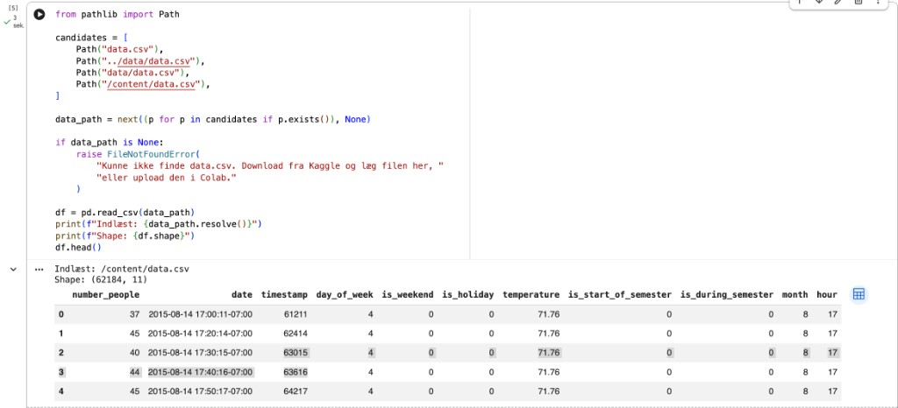
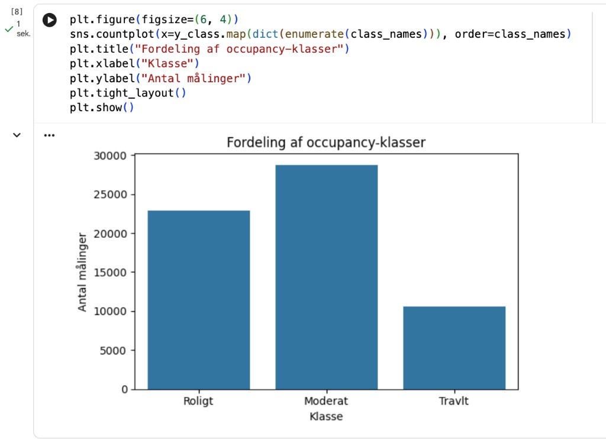
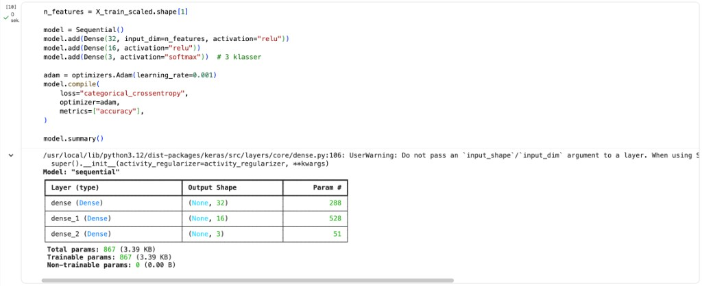
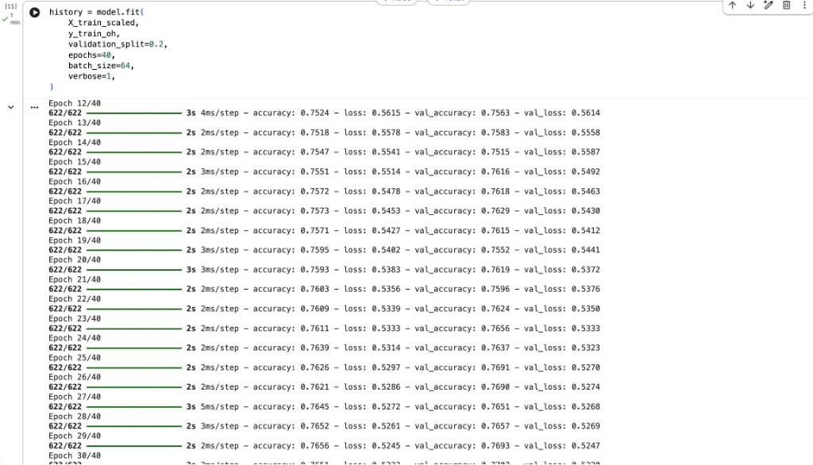
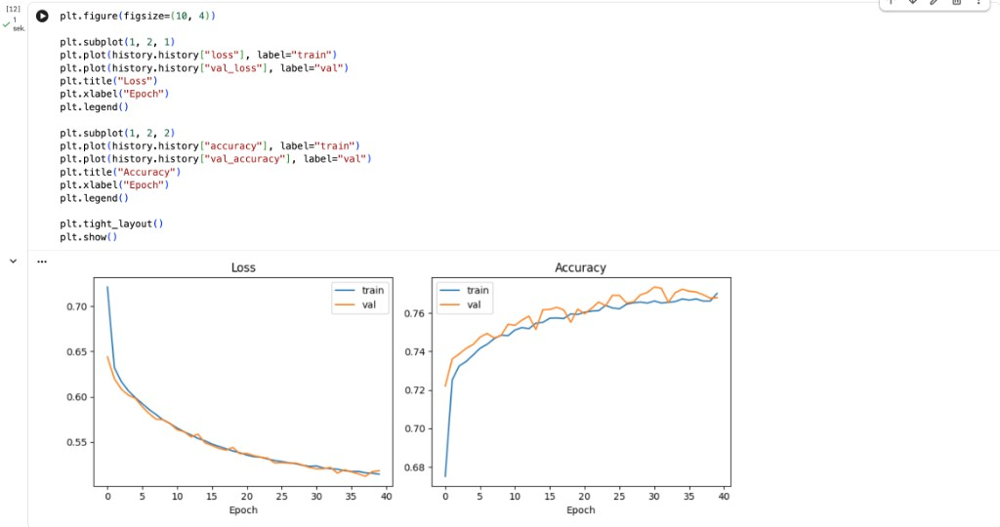
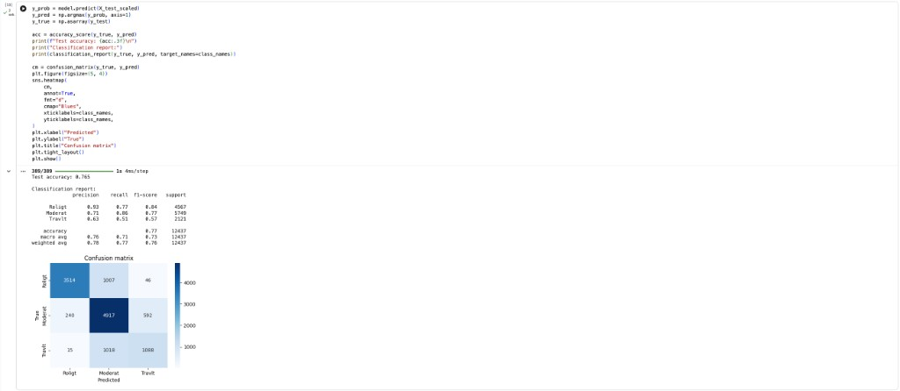
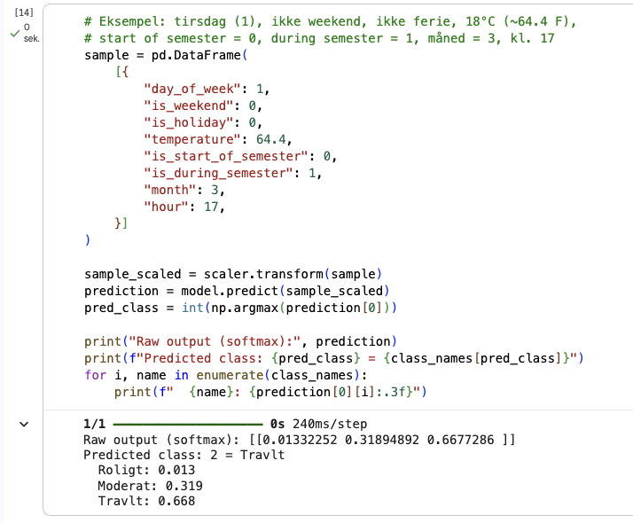

# Eksamensprojekt: Forudsig travlhed i fitnesscenter

**Metode:** Deep Neural Network (DNN)  
**Værktøj:** Google Colab + Keras / TensorFlow  
**Notebook:** `notebooks/gym_occupancy_dnn.ipynb`

---

## 1. Problembeskrivelse

Jeg vil forudsige, hvornår et fitnesscenter er travlt, så bemanding og kundeinformation kan planlægges bedre.

Jeg løser problemet som klassifikation. Ud fra tid, vejr og semester-information forudsiger min DNN, om fitnesscentret er:

| Klasse | Betydning | Regel |
|---|---|---|
| 0 | Roligt | ≤ 20 personer |
| 1 | Moderat | 21–50 personer |
| 2 | Travlt | > 50 personer |

Projektet minder om people counting, men jeg bruger DNN på tabeldata — samme type metode som churn-eksemplet i pensum.

---

## 2. Datasæt

Jeg bruger datasættet Crowdedness at the Campus Gym fra Kaggle:  
https://www.kaggle.com/datasets/nsrose7224/crowdedness-at-the-campus-gym

Datasættet indeholder ca. 62.000 målinger af antal personer i et campus-fitnesscenter sammen med features som ugedag, time, temperatur, ferie og semester.

Jeg indlæste filen i Colab som `/content/data.csv`. Den har 62.184 rækker og 11 kolonner. Tabellen viser de første 5 målinger.

---

## 3. Dataforberedelse

Jeg bruger ikke `number_people` som input, fordi det er facit. I stedet bruger jeg disse features:

- `day_of_week`
- `is_weekend`
- `is_holiday`
- `temperature`
- `is_start_of_semester`
- `is_during_semester`
- `month`
- `hour`

Jeg omsætter `number_people` til 3 klasser: roligt, moderat og travlt.  
Data er ikke helt balanceret. Der er flest moderate og rolige målinger, og færre travle. Det forventer jeg, fordi fitnesscentret oftest ikke er overfyldt.

Moderat er størst (ca. 29.000), derefter Roligt (ca. 23.000), mens Travlt er mindst (ca. 11.000).

Jeg skalerer features med `StandardScaler`, one-hot encoder labels til `[1,0,0]`, `[0,1,0]` og `[0,0,1]`, og deler data i train/test (80/20) med `stratify`, så klassefordelingen bevares.

---

## 4. Træning

Jeg bygger et Deep Neural Network med Keras `Sequential`:

1. `Dense(32, relu)`
2. `Dense(16, relu)`
3. `Dense(3, softmax)`

Jeg bruger Adam med learning rate 0.001, loss `categorical_crossentropy`, 40 epochs og batch size 64.  
Arkitekturen følger pensum-stilen med `Sequential` og `Dense`, men med flere neuroner, fordi datasættet er større.

Netværket har 3 lag (32 → 16 → 3 neuroner) og 867 trainable parameters.

Under træningen stiger accuracy (ca. 0.75 → 0.77), og loss falder både på train og validation. Det viser, at netværket lærer uden tydelig overfitting.

---

## 5. Evaluering

Jeg evaluerer modellen på test-sættet med accuracy, classification report, confusion matrix og loss-/accuracy-kurver.

Loss falder, og accuracy stiger over epochs. Train- og val-kurverne følger hinanden tæt, så jeg vurderer, at modellen lærer og ikke overfitter tydeligt.

Min test accuracy er 0.765 (ca. 76,5%).  
Roligt klarer sig bedst (precision 0.93, F1 0.84).  
Travlt er sværest (F1 0.57) og bliver ofte forvekslet med Moderat. Det giver mening, fordi Travlt er den mindste klasse.

Jeg testede også én observation manuelt:

**Input:** tirsdag, kl. 17, under semester, ca. 18°C, ikke weekend/ferie

**Output:**
- Roligt: 0.013  
- Moderat: 0.319  
- Travlt: 0.668  

Modellen forudsiger Travlt. Det giver mening, fordi hverdag kl. 17 i semestret typisk er myldretid.

---

## 6. Metodevalg

Jeg bruger Deep Neural Network (DNN), fordi:

- opgaven er supervised learning på tabeldata
- flere features kan indgå i ikke-lineære mønstre
- metoden matcher pensum (samme spor som bank churn med Keras)

---

## 7. Konklusion

Jeg har gennemført en fuld ML-pipeline: problem, datasæt, dataforberedelse, træning og evaluering.

**Begrænsninger:** Jeg har valgt klasse-tærsklerne (20/50) manuelt, data kommer fra ét fitnesscenter, og klasserne er ikke helt balancerede.

Som næste skridt kunne jeg justere tærsklerne, afprøve flere lag/neuroner eller publicere en lille web-demo.
